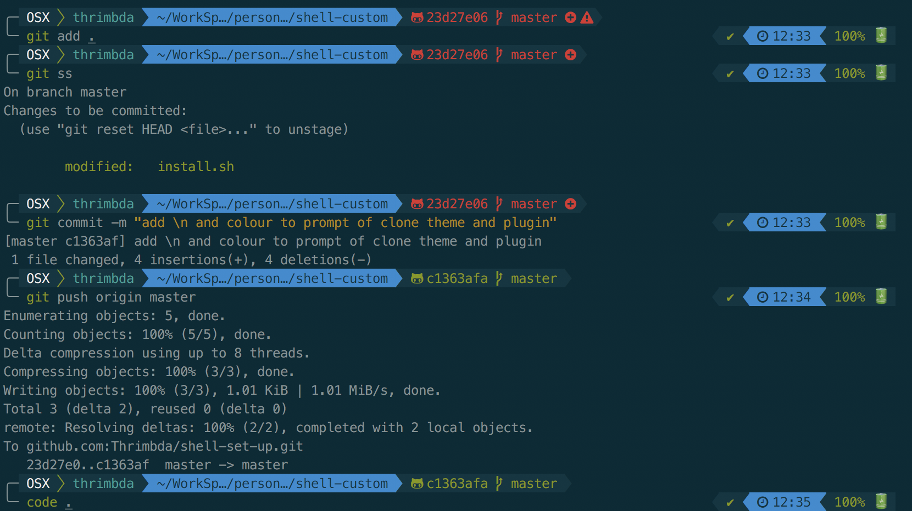

# shell-set-up

my personal shell set up script.

it's basically a customed adaptation of **[oh-my-zsh](https://ohmyz.sh/)** install script.

usage:

```bash
# via curl
sh -c "$(curl -fsSL https://raw.githubusercontent.com/Thrimbda/shell-set-up/master/install.sh)"

# via wget
sh -c "$(wget https://raw.githubusercontent.com/Thrimbda/shell-set-up/master/install.sh -O -)"
```

After which...Tada! And finally you will get this! Don't worry your old `.zshrc` would have a backup as `.zshrc.back`.(if you have one.)



if you want to adopt my configuration, you can replace `DEFAULT_USER` variable with your username in `.zshrc` and uncomment it if you want (default is `$USER@$HOSTNAME`).
